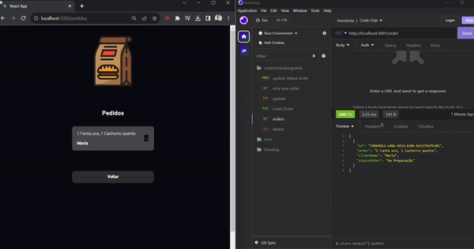

# Log de Pedidos com React e Node.js

Este projeto é um sistema de log de pedidos que utiliza `React` para a interface do usuário e `Node.js` para a API back-end. 

A aplicação permite a navegação entre páginas usando `react-router-dom`, e os dados dos pedidos são salvos e recuperados por meio da API Node.

## conhecimentos e habilidades adquiridas:

- 1 Criar uma aplicação React

>Aprender a configurar e estruturar uma aplicação React, incluindo a criação de componentes, gerenciamento de estado e manipulação de eventos.

- 2 Utilizar o Styled Components

>Explorar o uso do Styled Components para estilizar componentes React de uma maneira eficiente e modular, facilitando a manutenção do código CSS.

- 3 React Hooks

>Aprofundar-me no uso de React Hooks para gerenciar o estado e o ciclo de vida dos componentes de forma mais concisa e funcional.

- 4 Utilização de Rotas com `react-router-dom`

>Implementar a navegação entre páginas de forma dinâmica e amigável ao usuário utilizando o `react-router-dom`. Isso inclui a definição de rotas, passagem de parâmetros e manipulação de histórico de navegação.

- 5 Componentizar a Aplicação

>Dividir a aplicação em componentes reutilizáveis para promover uma arquitetura mais modular e fácil de manter. Isso inclui a criação de componentes para cabeçalho, rodapé, formulários de pedidos, etc.

<h3 align=center>🎬 Demonstração do funcionamento das funcionalidades de navegação:</h3>

    

